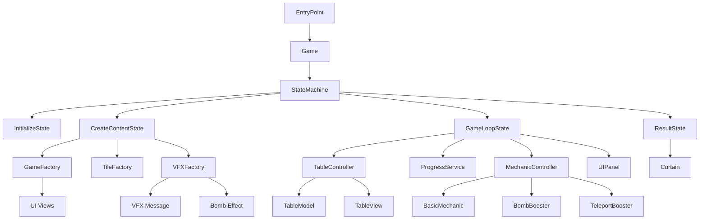

# Match-3 на Cocos Creator (typescript)

Проект представляет собой головоломку типа "три в ряд" с современной
архитектурой и расширенными возможностями.

# Основные особенности игры

- Динамическое игровое поле - случайная генерация уровня из нескольких конфигураций
- Система бустеров - специальная бомба для уничтожения групп плиток
- Гибкая система сложности - 4 уровня с разными параметрами
- Прогрессивная система очков - разные формулы расчета результатов
- Полноценный игровой цикл - победа/поражение с возможностью рестарта

# Технические особенности

- Удобное решение для геймдизайна - config.ts
- Проект строго следует принципам SOLID
- Реализована собственная система DI через ServiceLocator
- Машина состояний (State Machine) для управления игровым процессом
- Система механик с возможностью расширения
- Оптимизированная загрузка ресурсов
- Анимации интерфейса и игровых объектов
- Проект готов к дальнейшему расширению и может служить отличной базой для разработки коммерческих игр-головоломок

# Структура проекта

# Игровой процесс

**_Старт игры:_**
Случайная конфигурации поля
Генерация плиток разных типов

**_Основные действия:_**  
Клик по плитке уничтожает группу одинаковых соседей  
Плитки падают вниз, заполняя пустоты  
Генерация новых плиток сверху  
Использование бомбы (ограниченное количество)  
Использование телепорта (ограниченное количество)  

**_Условия победы:_**
Достижение целевого количества очков за ограниченное число ходов
Формула очков: groupSize "*" groupSize "*" 5 или groupSize (выбирается случайно)

**_Экран результатов:_**
Анимированный занавес с сообщением
Кнопки "Продолжить" (при победе) и "Рестарт" (при поражении)
